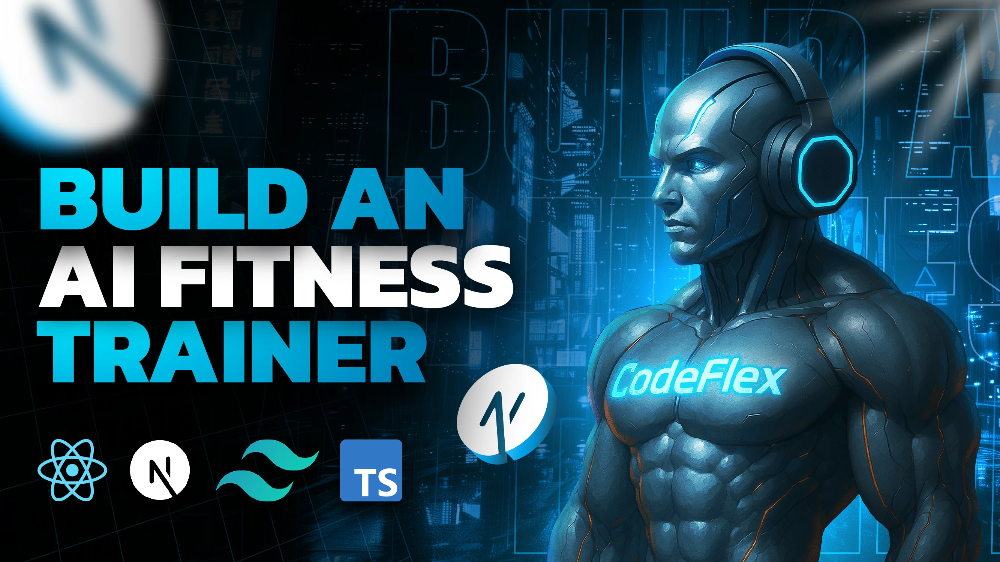

# Fyra AI - Voice-Powered Fitness Assistant

[](https://nextjs.org/)
[](https://react.dev/)
[](https://www.typescriptlang.org/)
[](https://tailwindcss.com/)
[](https://clerk.dev/)
[](https://convex.dev/)
[](https://ai.google.dev/)

**Fyra AI** is a modern, AI-powered fitness assistant that generates personalized workout and diet plans through natural voice conversations. Simply talk to the AI assistant, answer a few questions about your fitness goals, and receive a customized fitness program tailored specifically to you.



## Features

- **Voice-Based AI Conversation** - Interact with your fitness assistant naturally using speech recognition and synthesis
- **Personalized Workout Plans** - AI-generated workout routines based on your goals, experience, and preferences
- **Customized Diet Plans** - Meal plans with calculated calorie targets using scientific BMR formulas
- **Smart Calorie Calculator** - Automatically calculates daily caloric needs using the Mifflin-St Jeor equation
- **Multi-Plan Management** - Create and switch between multiple fitness plans
- **Graceful Fallback System** - 72 pre-generated plans ensure service availability even if AI fails
- **Real-Time Visual Feedback** - Animated voice waveforms, status indicators, and smooth state transitions
- **Secure Authentication** - Clerk-powered auth with seamless Convex integration

## Tech Stack

### Frontend
- **Framework:** [Next.js 15.5.9](https://nextjs.org/) with App Router
- **Language:** [TypeScript 5](https://www.typescriptlang.org/)
- **Styling:** [Tailwind CSS 4](https://tailwindcss.com/) with custom silver/chrome theme
- **UI Components:** Radix UI (Accordion, Tabs, Slot)
- **Icons:** Lucide React
- **Fonts:** Geist Sans & Geist Mono

### Backend & Services
- **Database:** [Convex](https://convex.dev/) - Serverless backend with real-time queries
- **Authentication:** [Clerk](https://clerk.dev/) - Complete user management
- **AI Engine:** [Google Gemini](https://ai.google.dev/) - 2.5 Flash/Pro models

### Voice Technology
- **Speech Recognition:** Web Speech API (browser-native)
- **Speech Synthesis:** Web Speech Synthesis API
- **Language Support:** English (en-US)

## Project Structure

```
Fyra-AI fitness assistant/
├── convex/                          # Convex backend
│   ├── auth.config.ts               # Clerk authentication config
│   ├── http.ts                      # HTTP routes (webhooks)
│   ├── plans.ts                     # Plan CRUD operations
│   ├── schema.ts                    # Database schema
│   ├── users.ts                     # User sync operations
│   └── _generated/                  # Auto-generated Convex types
├── public/                          # Static assets
│   ├── ai-avatar.png                # AI assistant avatar
│   ├── hero-ai*.png                 # Hero images
│   └── screenshot-for-readme.png
├── src/
│   ├── app/                         # Next.js App Router pages
│   │   ├── (auth)/                  # Auth routes (grouped)
│   │   │   ├── sign-in/
│   │   │   └── sign-up/
│   │   ├── api/                     # API routes
│   │   │   ├── chat/                # Chat conversation API
│   │   │   ├── extract-data/        # Data extraction API
│   │   │   └── generate-plan/       # Plan generation API
│   │   ├── generate-program/        # Voice conversation page
│   │   ├── profile/                 # User profile page
│   │   ├── globals.css              # Global styles
│   │   ├── layout.tsx               # Root layout
│   │   └── page.tsx                 # Homepage
│   ├── components/                  # React components
│   │   ├── ui/                      # Reusable UI components
│   │   │   ├── accordion.tsx
│   │   │   ├── alert.tsx
│   │   │   ├── button.tsx
│   │   │   ├── card.tsx
│   │   │   └── tabs.tsx
│   │   ├── voice-assistant/         # Voice-specific components
│   │   │   ├── ConversationDisplay.tsx
│   │   │   ├── StatusIndicator.tsx
│   │   │   └── VoiceButton.tsx
│   │   ├── AIVisualDisplay.tsx
│   │   ├── BackgroundEffects.tsx
│   │   ├── CyberButton.tsx
│   │   ├── Navbar.tsx
│   │   ├── ProfileHeader.tsx
│   │   ├── StatsCard.tsx
│   │   └── UserPrograms.tsx
│   ├── constants/                   # App constants
│   ├── data/                        # Static data
│   │   └── preGeneratedPlans.json   # 72 fallback plans
│   ├── hooks/                       # Custom React hooks
│   │   ├── useSpeechRecognition.ts
│   │   ├── useSpeechSynthesis.ts
│   │   └── useVoiceAssistant.ts     # Main voice hook
│   ├── lib/                         # Utility libraries
│   │   ├── gemini.ts                # Gemini AI client
│   │   ├── prompts.ts               # AI prompts
│   │   └── utils.ts                 # Utility functions
│   ├── providers/                   # React providers
│   │   └── ConvexClerkProvider.tsx  # Convex + Clerk integration
│   ├── types/                       # TypeScript types
│   └── middleware.ts                # Next.js middleware (auth)
├── components.json                  # shadcn/ui config
├── next.config.ts                   # Next.js config
├── package.json                     # Dependencies
├── tailwind.config.ts               # Tailwind config
└── tsconfig.json                    # TypeScript config
```

## How It Works

### 1. Voice Conversation Flow
1. User clicks "Start Call" to begin a voice conversation
2. AI assistant asks 3 questions about fitness profile:
   - Age, gender, height, weight
   - Fitness goal, activity level, experience, workout preference, training days
   - Dietary restrictions and health conditions
3. AI extracts structured data from conversation using Gemini
4. System generates personalized workout & diet plans
5. User is redirected to profile page to view their new plan

### 2. AI Plan Generation
- **Calorie Calculation:** Uses Mifflin-St Jeor BMR formula with activity multipliers and goal adjustments
- **Workout Generation:** AI creates structured workout schedules with exercises, sets, and reps
- **Diet Generation:** AI creates meal plans matching calculated daily caloric targets
- **Fallback System:** 72 pre-generated plans ensure reliability if AI generation fails

### 3. Data Flow
```
Voice Input → Speech Recognition → Chat API → AI Response → Speech Synthesis
                                    ↓
                           Extract Data API (Gemini)
                                    ↓
                           Generate Plan API (Gemini + Fallback)
                                    ↓
                           Save to Convex Database
                                    ↓
                           Display in Profile
```

## Getting Started

### Prerequisites

- **Node.js:** 20 or higher
- **npm:** Latest version
- **Clerk Account:** For authentication ([sign up](https://clerk.dev/))
- **Convex Account:** For database ([sign up](https://convex.dev/))
- **Google AI API Key:** For Gemini ([get key](https://ai.google.dev/))

### Installation

1. **Clone the repository:**
   ```bash
   git clone <repo-url>
   cd "Fyra-AI fitness assistant"
   ```

2. **Install dependencies:**
   ```bash
   npm install
   ```

3. **Set up environment variables:**
   ```bash
   cp .env.example .env.local
   ```

4. **Configure environment variables in `.env.local`:**
   ```env
   # Clerk Authentication
   NEXT_PUBLIC_CLERK_PUBLISHABLE_KEY=pk_test_...
   CLERK_SECRET_KEY=sk_test_...
   CLERK_WEBHOOK_SECRET=whsec_...

   # Convex Database
   NEXT_PUBLIC_CONVEX_URL=https://xxx.convex.cloud

   # Google AI (Gemini)
   GOOGLE_GENERATIVE_AI_API_KEY=AIza...
   ```

5. **Set up Convex:**
   ```bash
   # Install Convex CLI (if not already installed)
   npm install -g convex

   # Login to Convex
   npx convex login

   # Initialize Convex development server
   npx convex dev
   ```

6. **Set up Clerk webhook:**
   - Go to Clerk Dashboard → Webhooks
   - Add endpoint: `https://your-convex-url.convex.site/clerk-webhook`
   - Select events: `user.created`, `user.updated`
   - Copy webhook secret to `CLERK_WEBHOOK_SECRET`

7. **Start the development server:**
   ```bash
   # Terminal 1: Start Next.js dev server
   npm run dev

   # Terminal 2: Start Convex dev server (if not running)
   npx convex dev
   ```

8. **Open the application:**
   - Frontend: http://localhost:3000
   - Convex Dashboard: https://dashboard.convex.dev

## API Routes

| Route | Method | Description |
|-------|--------|-------------|
| `/api/chat` | POST | Returns deterministic questions for voice conversation |
| `/api/extract-data` | POST | Extracts structured health data from conversation using Gemini |
| `/api/generate-plan` | POST | Generates workout and diet plans using AI or fallback system |

## Database Schema

### Users Table
```typescript
{
  _id: Id<"users">,
  name: string,
  email: string,
  image?: string,
  clerkId: string
}
```

### Plans Table
```typescript
{
  _id: Id<"plans">,
  userId: string,
  name: string,
  workoutPlan: {
    schedule: string[],
    exercises: Array<{
      day: string,
      routines: Array<{
        name: string,
        sets?: number,
        reps?: number,
        duration?: string,
        description?: string
      }>
    }>
  },
  dietPlan: {
    dailyCalories: number,
    meals: Array<{
      name: string,
      foods: string[]
    }>
  },
  isActive: boolean
}
```

## Key Algorithms

### Calorie Calculation (Mifflin-St Jeor)
```typescript
// BMR Calculation
const bmr = gender === "male"
  ? 10 * weight + 6.25 * height - 5 * age + 5
  : 10 * weight + 6.25 * height - 5 * age - 161;

// Activity Multipliers
const multipliers = {
  sedentary: 1.2,
  light: 1.375,
  moderate: 1.55,
  active: 1.725,
  very_active: 1.9
};

// Goal Adjustments
if (goal === "lose_weight") calories -= 500;
if (goal === "build_muscle") calories += 300;
if (goal === "improve_fitness") calories += 100;
```

### Fallback Plan Matching
Progressive 5-level matching algorithm ensures users always receive a plan:
1. Exact match (gender + goal + activity + weight range)
2. Without weight range
3. Without activity level
4. Gender only
5. First available plan (ultimate fallback)

## Scripts

| Command | Description |
|---------|-------------|
| `npm run dev` | Start development server with Turbopack |
| `npm run build` | Create production build |
| `npm start` | Start production server |
| `npm run lint` | Run ESLint |
| `npx convex dev` | Start Convex development server |
| `npx convex deploy` | Deploy Convex backend to production |

## Deployment

### Frontend (Vercel - Recommended)
1. Connect your GitHub repository to Vercel
2. Add all environment variables from `.env.local`
3. Deploy

### Backend (Convex)
```bash
npx convex deploy
```

## Browser Support

- **Chrome/Edge:** Full support (best experience)
- **Safari:** Full support
- **Firefox:** Partial support (speech APIs may vary)
- **Mobile browsers:** Limited support for speech recognition

## Troubleshooting

| Issue | Cause | Solution |
|-------|-------|----------|
| Speech recognition not working | Browser not supported | Use Chrome, Edge, or Safari |
| AI plan generation failing | API key missing | Check `GOOGLE_GENERATIVE_AI_API_KEY` |
| Authentication issues | Clerk keys incorrect | Verify environment variables |
| Convex queries failing | Convex URL incorrect | Check `NEXT_PUBLIC_CONVEX_URL` |
| Webhook not syncing users | Webhook secret incorrect | Verify `CLERK_WEBHOOK_SECRET` |

## Future Enhancements

- Plan editing and customization
- Progress tracking and workout logging
- Social features and community sharing
- Mobile app (React Native)
- Multi-language support
- Exercise demonstration videos
- Detailed nutrition database

## Contributing

Contributions are welcome! Please feel free to submit a Pull Request.

1. Fork the repository
2. Create your feature branch (`git checkout -b feature/AmazingFeature`)
3. Commit your changes (`git commit -m 'Add some AmazingFeature'`)
4. Push to the branch (`git push origin feature/AmazingFeature`)
5. Open a Pull Request

## License

Private - All rights reserved.

---

**Built with Next.js, Convex, Clerk, and Google Gemini**

For detailed technical documentation, see [DOCUMENTATION.md](./DOCUMENTATION.md).
